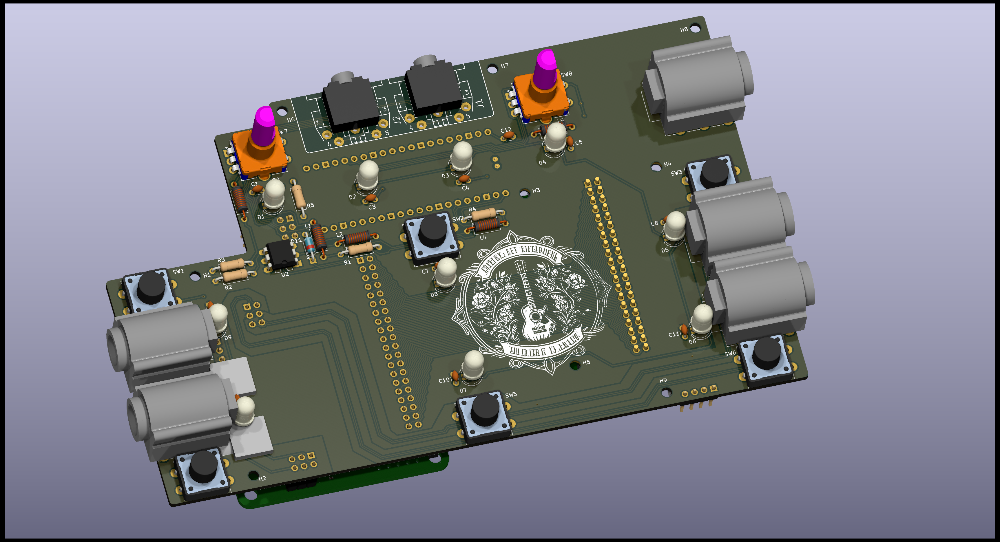
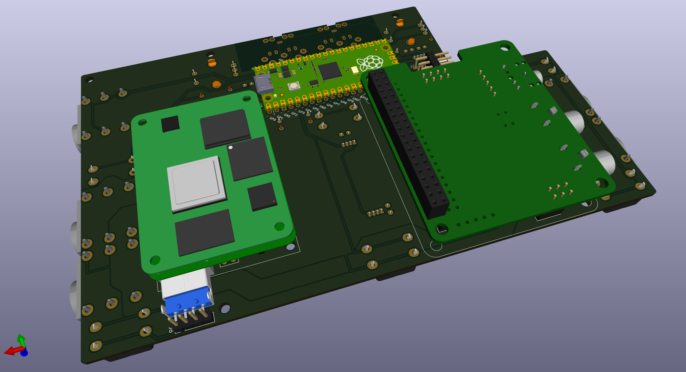

# Pedalboard Audio/MIDI Processer Hardware

An open hardware for processing Audio and/or MIDI data on a pedalboard.

## Modules

### Audio Processing
- RPI Compute Module 4
- HIFIBERRY DAC+ ADC PRO

### MIDI and Control Surface
- RPI pico processor
- 6 Buttons
- 2 Rotary Encoders
- Input for Expression Pedalb
- 10 RGB Leds
- Optional RGB Matrix
- MIDI I/O

## Design Goals
- Modular Design (Audio Processor is optional)
- Maker friendly
  - Minimal SMD soldering (to make it more Maker friendly)
  - Use of existing modules for the heavy lifting
- Avialabilit of components

## 3D View

The Design is still in progress, the pictures are previews.

## Notes

### KiCad components

* [HifiBerry DAC/ADC+](https://github.com/hifiberry/kicad_template_dac_adc_stage)
* [RPI pico](https://github.com/ncarandini/KiCad-RP-Pico)
* [MIDI DIN5/180](https://github.com/nebs/eurocad)
* [PIHat Mechanical Spec](https://github.com/raspberrypi/hats/blob/master/hat-board-mechanical.pdf)

### Hardware

* Switch https://www.digikey.ch/de/products/detail/cui-devices/TS14-1212-50-BK-100-SCR-D/16562826
* Pogo Pin: https://www.farnell.com/datasheets/2625427.pdf
* USB-A: https://www.mouser.ch/ProductDetail/GCT/USB1061-GF-L-A?qs=KUoIvG%2F9IlYSthVIrIBVzQ%3D%3D

FIXME: Replace the above list with a proper BOM

### Ideas

* Output stage https://www.amb.org/audio/
* Ribbon Mic: https://www.bumblebeepro.com/rm-5-diy-ribbon-mic-full-kit/
