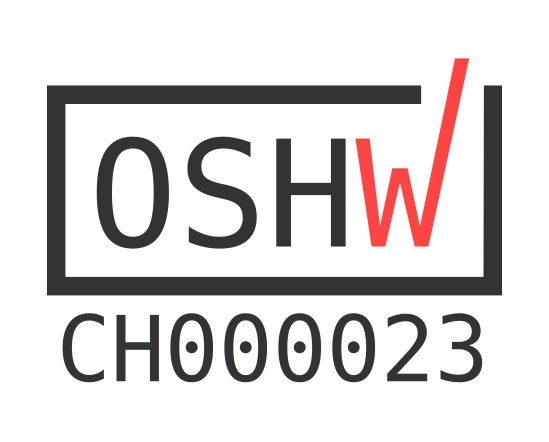

# Open Pedalboard  Mainboard

Mainboard for processing audio and/or MIDI data on a pedalboard.

| Open Source Hardware | OSHWA Certification|
|---|---|
|  |  |

This PCB is designed with [KiCad 8](https://www.kicad.org/blog/2024/02/Version-8.0.0-Released/)

## Design Goals

- Visual Feedback with RGB LED Rings
- Modular Design:
  - The device can be used:
     1. MIDI controller only (Low Cost)
     1. both for MIDI and Audio, communication between the modules is done via MIDI.
  - MIDI Module has independent microcontroller and firmware with immediate startup
  - Optional Power supply module if no USB Power is available on the board.
- Maker friendly
  - Use of existing modules for the heavy lifting
  - Use of common components
- Flat design: target for case height: 30mm

## Modules

### Audio Processing

- Raspberry Pi [Compute Module 4](https://www.raspberrypi.com/products/compute-module-4/) or [Compute Module 5](https://www.raspberrypi.com/products/compute-module-5/)
  - Flexible memory options for cost optimisation
  - (optional) WiFi
  - Very low latency (around 2ms when using ELK Audio OS)
- [Pedalboard Soundcard DAC ADC](https://github.com/pedalboard/pedalboard-soundcard)
   (under construction)
  - Two channel Differential input/output
- or HiFiBerry [DAC+ ADC PRO](https://www.hifiberry.com/shop/boards/hifiberry-dac-adc-pro/)
  - Hiqh Quality Stereo Input/Output
- USB A Host
- Mini USB Device mode (for firmware update)

### MIDI and Control Surface

- 200mm x 100mm control surface. Still not too large but can hold 6 buttons.
- Raspberry [RP-2040](https://datasheets.raspberrypi.com/rp2040/rp2040-datasheet.pdf)
  processor with a custom [firmware](https://github.com/pedalboard/pedalboard-midi)
  that can be updated via USB or also from the audio module via WLAN.
- 6 Buttons supporting to trigger on push, on release, long and short presses
- 2 Rotary Encoders with additional push button
- 2 Inputs for Expression Pedal
- 2 RGB Leds
- 8 [RGB LED-rings](https://github.com/pedalboard/pedalboard-led-ring)
  around each foot button.
- (Optional) RGB Matrix: in a Matrix of RGB Pins even more information can be expressed
  and readable from a large distance. For example the current preset number or a
  db meter value.
- STEMMA I2C connector for 2 OLED displays
- I2C EEPROM for config storage
- Flexibile MIDI I/O
  - DIN 5 Plug
  - or 3.5mm Mini TRS Plug
  - and/or Header Pins for wiring off-board plug
  - USB Midi

### Power Supply

Flexible power supply options

- 6-28V Power input to connect to usual pedalboard power supply units.
  - 3A DC-DC buck converter
  - Also powers MIDI module
- MIDI module can also be powered with USB power.
  - Supports ORing with the onboard PSU.

## Generated Hardware Documentation

Interactive [KiCanvas](https://kicanvas.org/?github=https%3A%2F%2Fgithub.com%2Fpedalboard%2Fpedalboard-hw%2Ftree%2Fmain) viewer.

Downloadable [Assets](https://pedalboard.github.io/pedalboard-hw-site/latest/Browse/pedalboard-hw-navigate.html) are generated with [KiBot](https://github.com/INTI-CMNB/KiBot)

## Fabrication

- [Generated iBOM](https://pedalboard.github.io/pedalboard-hw-site/latest/Assembly/pedalboard-hw-ibom.html)
- [Digi-Key shared list](https://www.digikey.ch/de/mylists/list/DJ3I9KG222)
- [PCBWay manifacturing](https://www.pcbway.com/project/shareproject/Open_Source_Pedalboard_Platform_8e065d23.html)
- For detailed build instruction follow the [wiki](https://github.com/pedalboard/pedalboard-hw/wiki)

## 3D Views

## Mechanical Parts

3D printable parts can be found in the [pedalboard-case](https://github.com/pedalboard/pedalboard-case) project.

### References

- [HifiBerry DAC/ADC+](https://github.com/hifiberry/kicad_template_dac_adc_stage)
- [PIHat Mechanical Spec](https://github.com/raspberrypi/hats/blob/master/hat-board-mechanical.pdf)

### How to release

see [Release Procedure](doc/release-procedure.md)
